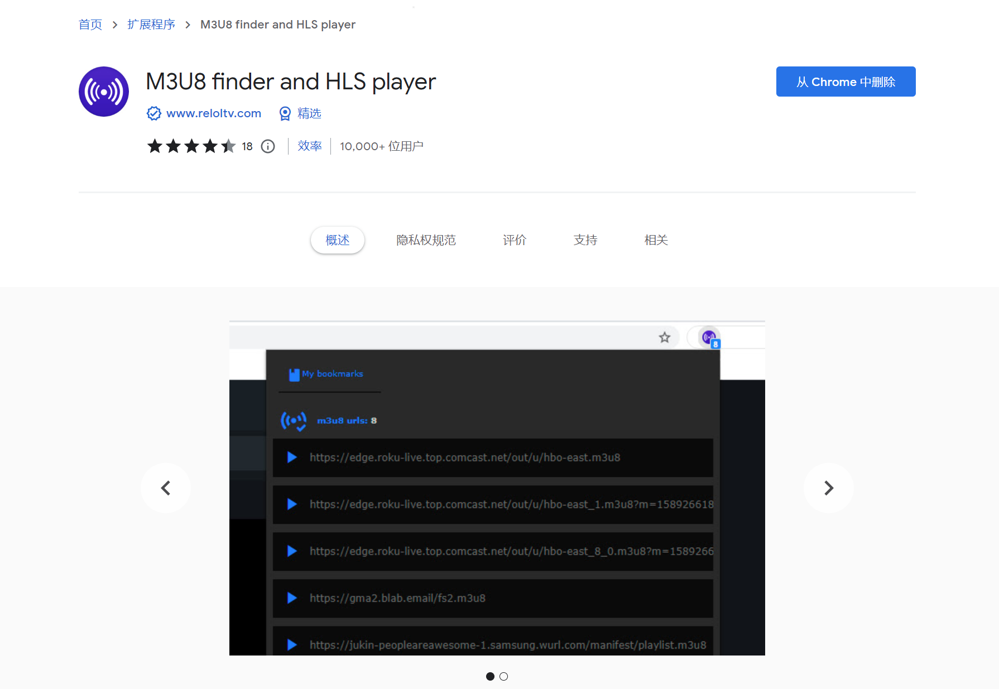
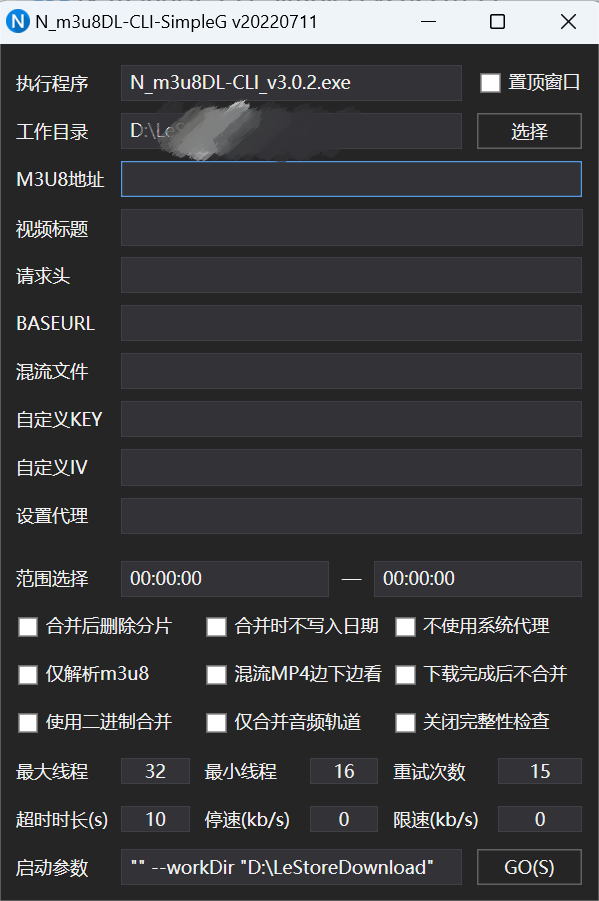
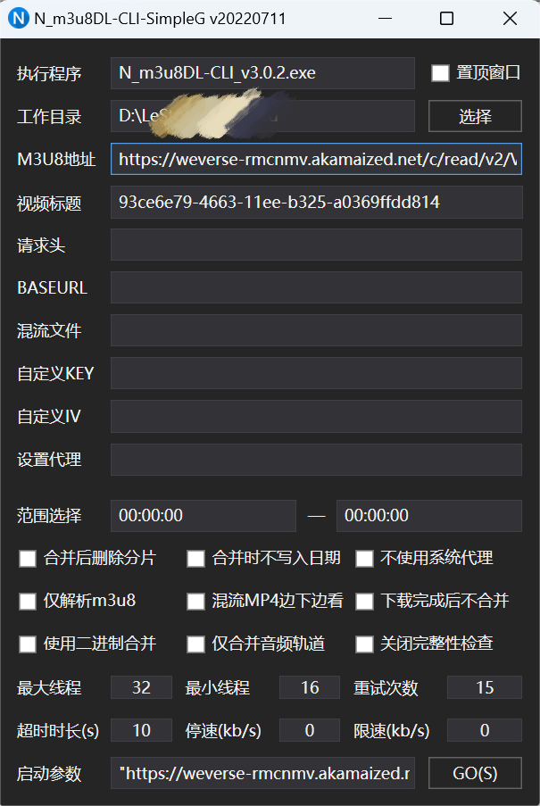
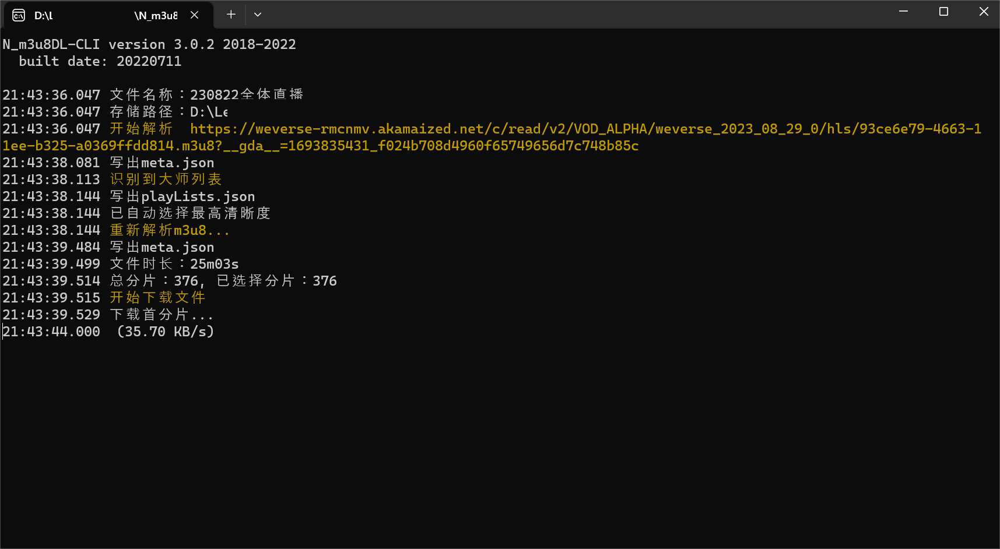

# Weverse视频下载方法

中文/[English](Weverse%20Video%20Download.md)

<aside>
💡 首先下载所需的工具

</aside>

1. **M3U8 finder and HLS player**
    
    首先，在谷歌应用商店中搜索"M3U8 finder and HLS player"，或者直接点击[官方链接](https://chrome.google.com/webstore/detail/m3u8-finder-and-hls-playe/gijhpnmjcpbddpedmmdihijogkkejfgj)。
    
    
    
    让大家看看这个插件长什么样子，别下错了。
    
2. **N_m3u8DL-CLI-SimpleG**
    
    下载[N_m3u8DL-CLI_v3.0.2_with_ffmpeg_and_SimpleG.zip](https://github.com/nilaoda/N_m3u8DL-CLI/releases/download/3.0.2/N_m3u8DL-CLI_v3.0.2_with_ffmpeg_and_SimpleG.zip)（点击链接即可）。
    
    下载并解压后，文件夹大概长这样：
    
    
    
    第一次打开没有Logs文件夹是正常的
    
    双击 **N_m3u8DL-CLI-SimpleG**，打开后是这样的：
    
    
    

> **工具下载完毕**
> 

---

<aside>
💡 下载步骤（实例）

</aside>

1. 打开要下载的 Weverse 视频页面。
    
    
    
2. 在扩展程序中点击之前下载好的 M3U8 Finder and HLS Player 插件。
    
    
    
3. 获取 M3U8 地址。
    
    通常来说，这四个链接都是可以使用的。我一般会直接使用第一个链接，右键点击复制链接地址即可。
    
    
    
4. 打开 **N_m3u8DL-CLI-Simple**，链接会自动复制到M3U8地址里，再选择工作目录（即保存地址），重命名视频标题，然后点击 GO(S)。
    
    
    
5. 等待下载完毕。
    
    