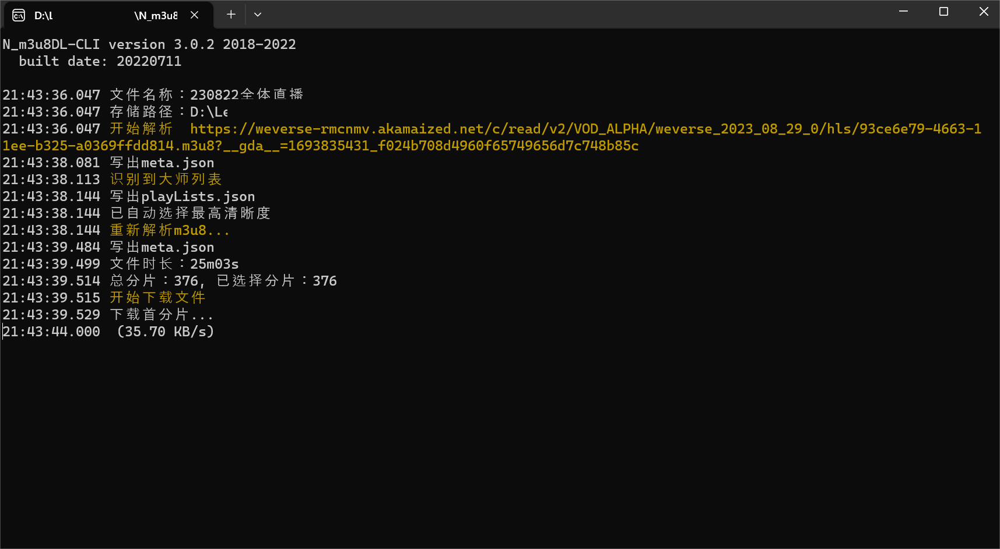

# Weverse Video Download

[中文](README.md)/English

<aside>
💡 First, Download the Required Tools

</aside>

1. **M3U8 finder and HLS player**
    
    First, search for "M3U8 Finder and HLS Player" on the Google Chrome Web Store, or simply click the **[official link](https://chrome.google.com/webstore/detail/m3u8-finder-and-hls-playe/gijhpnmjcpbddpedmmdihijogkkejfgj)**.
    
    
    
    >Make sure you're downloading the right extension by looking at this screenshot.
    
2. **N_m3u8DL-CLI-SimpleG**
    
    Download **[N_m3u8DL-CLI_v3.0.2_with_ffmpeg_and_SimpleG.zip](https://github.com/nilaoda/N_m3u8DL-CLI/releases/download/3.0.2/N_m3u8DL-CLI_v3.0.2_with_ffmpeg_and_SimpleG.zip)** (just click the link).
    
    After downloading, unzip the file. Your folder should look like this:
    
    
    
    >It's normal not to have a "Logs" folder when you first open it.
    
    Double-click **N_m3u8DL-CLI-SimpleG**, and it will open like this:
    
    
    

 **Tools Downloaded Successfully ！！！**

---

<aside>
💡 Download Steps (Example)

</aside>

1. Open the video page you want to download from.
    
    
    
2. Click on the M3U8 Finder and HLS Player extension in your browser.
    
    
    
3. Obtain the M3U8 URL.
    
    Typically, any of these four links will work. I usually use the first one; simply right-click to copy the link address.
    
    
    

1. Open **N_m3u8DL-CLI-Simple**, and the link will automatically be copied to the M3U8 address field. Choose the directory (where you want to save the video), rename the video title, and click GO(S).
    
    
    
2. Wait for the download to complete.
    
    